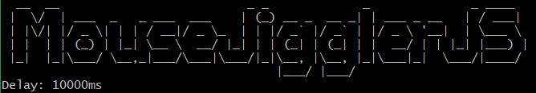

[](https://github.com/lidiogomes/mousejigglerjs)
[](https://github.com/lidiogomes/mousejigglerjs)
[](https://github.com/lidiogomes/mousejigglerjs/blob/main/LICENSE)
[](https://github.com/lidiogomes/mousejigglerjs/stargazers)
[](https://github.com/lidiogomes/mousejigglerjs/network/members)
[](https://github.com/lidiogomes/mousejigglerjs)

# MouseJigglerJS



<br />

> A mouse jiggler written in javascript to move your mouse and the computer doesn't fall asleep.

## Requirements

Use the package manager section to install nodejs in different operating systems

[https://nodejs.org/en/download/package-manager/](https://nodejs.org/en/download/package-manager/)

One of the following versions of [Node.js](https://nodejs.org/en/download/) must be installed to run **`npm`**:

* `14.x.x` >= `14.17.0`
* `16.x.x` >= `16.13.0`
* `18.0.0` or higher

### Windows:
```
> choco install nodejs
```
```
> node --version
v18.12.1
> npm --version
9.2.0s
```
### Linux:
```
$ sudo apt update
$ sudo apt install -y nodejs
```
```
$ node --version
v18.12.1
$ npm --version
9.2.0
```
### MacOS:
```
brew install node
```
```
node --version
v18.12.1
npm --version
9.2.0
```

## Install

```
$ npm install -g mousejigglerjs
```

## Usage
Keep the machine awake
```
$ mousejiggler
```


To stop the mouse movement
```
Ctrl + c
```
Set the delay of mouse move
```
$ mousejiggler --delay=10000
```
Turn off logo
```
$ mousejiggler --logo-off
```

## Commands

| Command    | Alias | Description                 |
|------------|-------|-----------------------------|
| --version  |       | Show version number         |
| --delay    | -d    | Delay of mouse move         |
| --logo-off |       | Turn off logo               |
| --help     |       | Show help                   |

## Notes

The time it takes the mouse to move is calculated in milliseconds. If you set a time below 5000ms and accidentally click outside the terminal, you may have trouble terminating the mousejigglerjs. 
By default time = 10000.

```
Ctrl + Alt + Delete
```